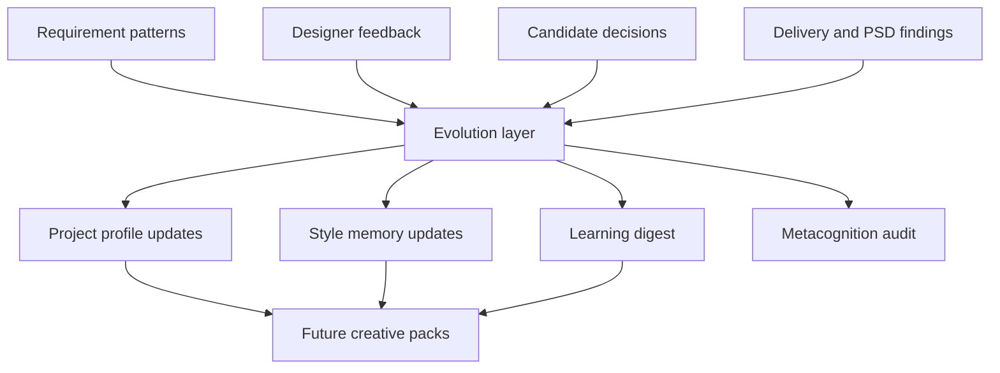

# CrealityOS Architecture Blueprint

CrealityOS is implemented as the `design-copilot` Python package. It is a local-first design production operating system: it turns Meegle or local requirements into design briefs, style memory, creative packs, image production plans, PSD handoff plans, delivery readiness checks, and review/writeback artifacts.

This document describes the intended architecture without changing the current runtime behavior.

## Architecture Goals

- Keep current CLI commands, output schemas, and safety gates stable.
- Make the system readable by capability domain instead of by a flat file list.
- Separate the production flow from the evolution flow.
- Keep external actions behind explicit confirmation gates.
- Treat local workspace and memory folders as runtime data, not source architecture.

## Layer Model

```text
CLI Layer
  agent/cli.py

Application Orchestration Layer
  agent/app.py

Domain Capability Layer
  agent/core/*

Infrastructure Layer
  agent/adapters/*
  agent/memory/store.py
  agent/settings.py
  agent/shell.py
  agent/utils.py

Data Contract Layer
  agent/models.py

Runtime Data Layer
  memory/*
  workspace/*
  templates/*
```

## Capability Domains

The current source files are still flat under `agent/core/`, but the blueprint groups them into these domains:

```text
requirement/       Requirement intake, interpretation, clarification, field mapping.
style/             Style constraints, project profiles, style transfer and alignment.
creative/          Creative pack, design decisions, workflow and cycle planning.
generation/        Image variants, generation jobs, result registration, candidate review.
psd/               PSD reconstruction, slice specs, Photoshop/export automation.
delivery/          Delivery readiness, review packet, cockpit and dashboard.
collaboration/     Meegle writeback, publish gate, workflow transition gate.
session/           Session snapshots, resume, transition summaries, doctor checks.
evolution/         Self-evolution, learning governance, memory curation, metacognition.
```

## Primary Flow


## Evolution Flow

The production flow completes the current work item. The evolution flow learns from outcomes and affects later work items only through governed memory updates.



## Safety Boundaries

- Image generation jobs are prepared for confirmation; the system does not spend generation credits by default.
- Meegle comments and workflow transitions are dry-run or draft-first unless explicit confirmation is provided.
- PSD and delivery package steps stage files into workspace folders; they do not overwrite formal assets by default.
- K3 style hypotheses are preserved as exploratory notes and must not silently become executable prompt constraints.
- Runtime outputs in `workspace/runs`, `workspace/deliveries`, and `memory/projects` are data, not source logic.

## Current Centralization Points

`agent/app.py` is currently the main orchestration hub. It wires every adapter, builder, auditor, packager, and publisher together. This is stable and functional, but it is the largest future refactor target.

`agent/cli.py` is the user-facing command surface. It should remain backward compatible even if the internal module layout changes later.

`agent/models.py` is the schema backbone. Any field change here can affect persisted JSON, tests, dashboards, and downstream workflows.

## Recommended Future Structure

If code is later reorganized, use compatibility wrappers so existing imports continue to work:

```text
agent/core/requirement/
agent/core/style/
agent/core/creative/
agent/core/generation/
agent/core/psd/
agent/core/delivery/
agent/core/collaboration/
agent/core/session/
agent/core/evolution/
```

Keep the first pass documentation-only. Do not move modules until the domain map is accepted and tested.
