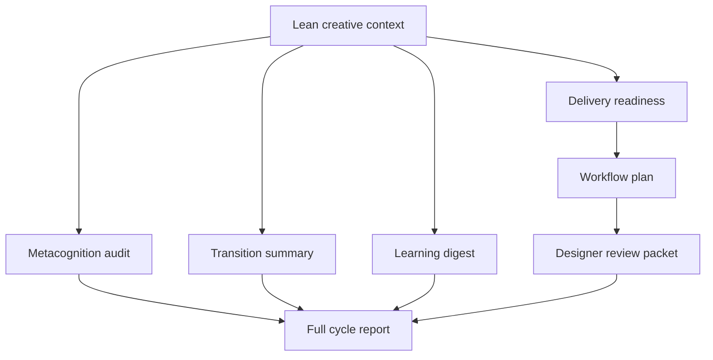
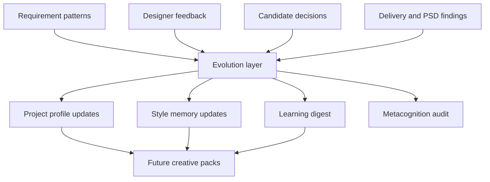

# CrealityOS Architecture Blueprint

CrealityOS is implemented as the `design-copilot` Python package. It is a local-first design production operating system: it turns Meegle or local requirements into design briefs, style memory, creative packs, image production plans, PSD handoff plans, delivery readiness checks, and review/writeback artifacts.

The current architecture is intentionally lean by default. Daily intake commands create only the artifacts needed for the current design step, while audit, learning, readiness, workflow planning, and designer review packets move behind explicit full-cycle commands.

This document describes the intended architecture without changing the current runtime behavior.

## Architecture Goals

- Keep current CLI commands, output schemas, and safety gates stable.
- Make the system readable by capability domain instead of by a flat file list.
- Separate the production flow from the evolution flow.
- Keep the daily copilot path lean and stage-aware.
- Keep external actions behind explicit confirmation gates.
- Treat local workspace and memory folders as runtime data, not source architecture.

## Layer Model

```text
CLI Layer
  agent/cli.py

Application Orchestration Layer
  agent/app.py
  agent/flows.py

Domain Capability Layer
  agent/core/*

Infrastructure Layer
  agent/adapters/*
  agent/memory/store.py
  agent/settings.py
  agent/shell.py
  agent/utils.py

Data Contract Layer
  agent/models.py

Runtime Data Layer
  memory/*
  workspace/*
  templates/*
```

## Operating Modes

CrealityOS now separates the default daily path from the complete governance path.

```text
Lean mode, default
  run-feishu-design-cycle
  run-local-design-cycle

Full mode, explicit
  run-feishu-design-cycle --full
  run-local-design-cycle --full
```

Lean mode is the default for both Meegle-backed and local requirements. It builds the requirement and creative context, records the immediate design decisions, prepares image-production guidance, and stops before heavy downstream governance artifacts.

Full mode preserves the complete loop. It adds metacognition audit, transition summary, learning digest, delivery readiness, workflow plan, and designer review packet generation.

When lean mode runs in an output directory that previously contains full-cycle byproducts, it removes the known full-only subdirectories `delivery_readiness`, `workflow`, and `review_packet` from that run directory. This keeps current run folders and artifact indexes aligned with the chosen operating mode.

## Capability Domains

The current source files are still flat under `agent/core/`, but the blueprint groups them into these domains:

```text
requirement/       Requirement intake, interpretation, clarification, field mapping.
style/             Style constraints, project profiles, style transfer and alignment.
creative/          Creative pack, design decisions, workflow and cycle planning.
generation/        Image variants, generation jobs, result registration, candidate review.
psd/               PSD reconstruction, slice specs, Photoshop/export automation.
delivery/          Delivery readiness, review packet, cockpit and dashboard.
collaboration/     Meegle writeback, publish gate, workflow transition gate.
session/           Session snapshots, resume, transition summaries, doctor checks.
evolution/         Self-evolution, learning governance, memory curation, metacognition.
```

## Primary Flow

```mermaid
flowchart LR
  A["Meegle or local requirement"] --> B["Requirement intake"]
  B --> C["Design brief"]
  C --> D["Style and project memory"]
  D --> E["Creative pack"]
  E --> F["Image production batch"]
  F --> G["Lean cycle report and designer workpack"]
  G --> H{"Continue production?"}
  H -->|Generate candidates| I["Generation jobs and execution package"]
  I --> J["Generation results"]
  J --> K["Candidate review, drift, comparison"]
  K --> L["PSD handoff and slice spec"]
  L --> M["Delivery readiness"]
  M --> N["Review packet, cockpit, dashboard"]
  N --> O["Meegle writeback and transition gates"]
```



## Full-Cycle Extension

The full cycle is not the default daily path. It is invoked when the user wants a complete governance loop or a release-quality handoff packet.



## Evolution Flow

The production flow completes the current work item. The evolution flow learns from outcomes and affects later work items only through governed memory updates.



## Safety Boundaries

- Image generation jobs are prepared for confirmation; the system does not spend generation credits by default.
- Meegle comments and workflow transitions are dry-run or draft-first unless explicit confirmation is provided.
- PSD and delivery package steps stage files into workspace folders; they do not overwrite formal assets by default.
- Lean cycle commands skip full-cycle audit, learning, readiness, workflow, and review artifacts unless `--full` is explicitly passed.
- Artifact indexes in workflow and review surfaces list existing artifacts only. Future-stage artifacts are not represented as missing unless that absence blocks the current stage.
- K3 style hypotheses are preserved as exploratory notes and must not silently become executable prompt constraints.
- Runtime outputs in `workspace/runs`, `workspace/deliveries`, and `memory/projects` are data, not source logic.

## Current Centralization Points

`agent/app.py` is the stable application facade used by the CLI and tests. It still wires adapters, builders, auditors, packagers, and publishers together, but cycle, delivery, image-direction, and memory/evolution orchestration have started moving into flow classes in `agent/flows.py`.

`agent/flows.py` is the incremental orchestration split. The current flow boundaries are `RequirementFlow`, `ImageFlow`, `DeliveryFlow`, and `MemoryFlow`. They call back into the existing app facade for shared helpers and persistence while keeping public command behavior stable.

`agent/cli.py` is the user-facing command surface. It should remain backward compatible even if the internal module layout changes later.

`agent/models.py` is the schema backbone. Any field change here can affect persisted JSON, tests, dashboards, and downstream workflows.

## Recommended Future Structure

If code is later reorganized, use compatibility wrappers so existing imports continue to work:

```text
agent/core/requirement/
agent/core/style/
agent/core/creative/
agent/core/generation/
agent/core/psd/
agent/core/delivery/
agent/core/collaboration/
agent/core/session/
agent/core/evolution/
```

Keep the first pass documentation-only. Do not move modules until the domain map is accepted and tested.
