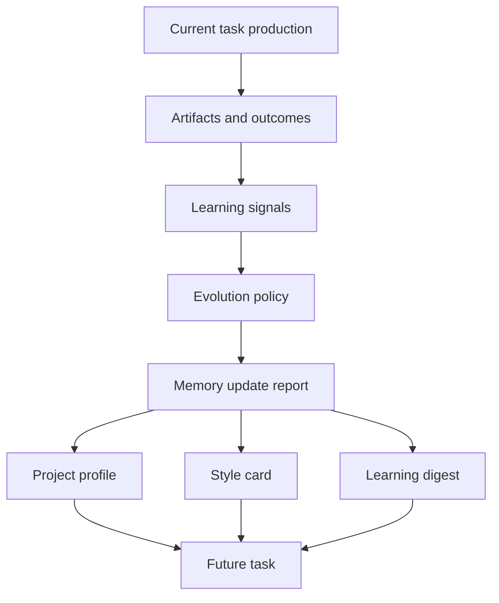

# Evolution Layer Blueprint

The evolution layer is the self-improvement and automated learning control layer. It is separate from the production flow.

Production completes the current work item. Evolution learns from evidence and updates future defaults only through governed memory changes.

## Recommended Location

Future code organization should treat this as a first-class capability domain:

```text
agent/core/evolution/
  feedback_learning.py
  reference_learning.py
  requirement_learning.py
  candidate_learning.py
  memory_curator.py
  learning_digest.py
  metacognition.py
  policy.py
  safeguards.py
  automation_learning.py
```

The current code remains flat, but these existing modules already belong to the evolution domain:

| Current module | Evolution role |
|---|---|
| `agent/core/style_learner.py` | Learns style rules from designer feedback. |
| `agent/core/style_references.py` | Learns from positive, negative, and exploratory references. |
| `agent/core/style_memory_curator.py` | Governs memory cleanup, K3 promotion suggestions, and avoid-rule syncs. |
| `agent/core/learning_digest.py` | Compresses memory into next-time defaults and checklists. |
| `agent/core/metacognition.py` | Audits uncertainty, blind spots, and memory health. |
| `agent/core/requirement_memory.py` | Learns recurring project defaults from requirement patterns. |
| `agent/core/candidate_review.py` | Converts variant decisions into learning signals. |
| `agent/core/project_profiles.py` | Applies durable project-level behavior changes. |

## Learning Signals

The evolution layer may consume:

- Designer feedback files.
- Candidate review decisions and scores.
- Positive, negative, and exploratory style references.
- Repeated requirement fields such as audience, platform, size, deliverables, and slicing needs.
- Delivery readiness warnings.
- PSD and slice spec findings.
- Meegle writeback review outcomes.
- Project profile calibration files.

## Learnable Knowledge

Safe learning targets include:

- Repeated project default sizes.
- Repeated platform and channel defaults.
- Confirmed gameplay tags.
- Confirmed visual keywords.
- Accepted style rules.
- Confirmed avoid rules.
- Naming templates.
- Slicing preferences.
- Dry-run automation preferences.
- Repeated blocker patterns that should be checked earlier.

## Knowledge Levels

The existing K-level model is the governance backbone.

| Level | Meaning | Evolution behavior |
|---|---|---|
| K1 | Explicit hard rule | Can enter executable guidance and delivery gates. |
| K2 | Confirmed or reliable rule | Can enter default prompts and project style guidance. |
| K3 | Exploratory hypothesis | Stays in notes, uncertainty, or exploration variants until confirmed. |
| K4 | Conflict or low-confidence signal | Requires human review and should not become default behavior. |

## Non-Automatic Upgrades

The system must not automatically promote:

- Single-instance aesthetic preference.
- K3 hypotheses with no repeated evidence.
- Rules that conflict with project forbidden rules.
- Brand, legal, compliance, or monetization-sensitive requirements.
- Any behavior that publishes externally.
- Any behavior that spends generation credits.
- Any behavior that overwrites formal files.
- Meegle workflow transition policy.

## Production And Evolution Separation



Rules:

- Current task execution should use the memory that existed when the task was built.
- Feedback and review outcomes should be written as separate artifacts.
- Durable memory changes should be explicit and traceable.
- K3 should not silently become executable prompt text.
- Reports should explain why a rule was accepted, rejected, or kept pending.

## Automation Learning

Automation learning should be conservative. It can learn preferences such as:

- Which PSD source file type is usually selected.
- Which export formats are common.
- Which slice groups are repeatedly required.
- Which dry-run checks catch problems early.
- Which staging layouts are easiest for designers to inspect.

Automation learning must not directly:

- Launch Photoshop.
- Export production assets.
- Save over PSD files.
- Publish comments.
- Transition Meegle nodes.
- Call paid generation tools.

## Suggested Future Policy Module

When the evolution layer becomes code-structured, add a policy module that centralizes promotion rules:

```python
def can_promote_signal(signal, evidence, project_profile) -> bool:
    ...

def target_level(signal, evidence) -> KnowledgeLevel:
    ...

def requires_designer_confirmation(action) -> bool:
    ...
```

This keeps self-evolution explainable and prevents scattered promotion rules.

