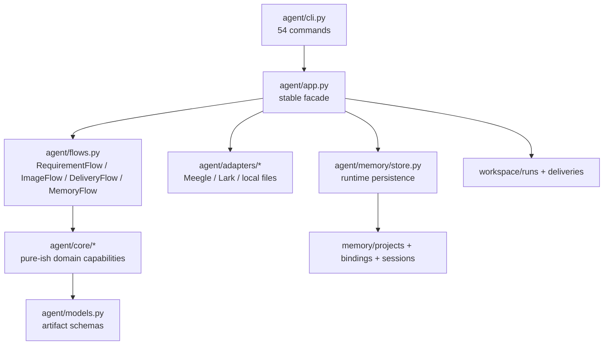
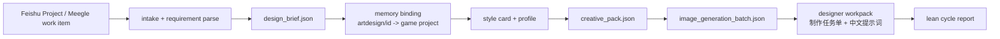
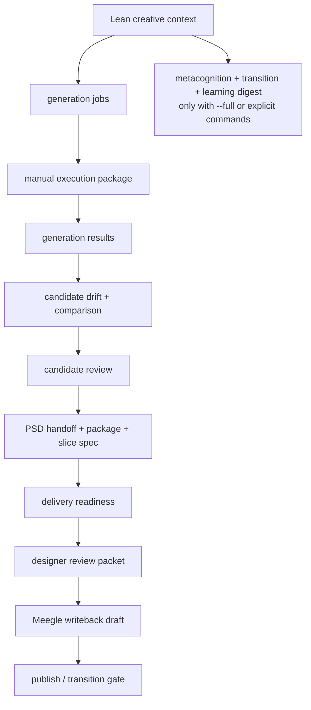

# CrealityOS System Architecture Audit - 2026-06-03

本报告站在两个视角审计当前系统：

- 架构师视角：模块边界、文件职责、流程闭环、可维护性、阻塞点。
- 设计师视角：日常入口是否清晰、产物是否有用、是否还会制造无效副产品。

结论先行：当前系统不是“文件太多所以要删”，而是“能力层已经较完整，但入口层、编排层、状态层还没有完全收敛”。默认 lean 流程已经能跑通，完整 full 流程也有测试覆盖；但 doctor、console、repo 内项目记忆仍有旧 full-cycle/PSD 默认的残留，会继续诱导系统做不必要的事。

## 1. 当前事实

### 1.1 验证结果

- `python -m unittest discover -s tests -v`
  - 结果：44 tests passed。
  - 覆盖：CLI 入口、核心逻辑、local/Feishu cycle、delivery、Meegle gate、memory/session。
- `python -m agent.cli doctor --project-key artdesign`
  - 结果：`ready_with_warnings`。
  - 阻塞项：无。
  - 警告：缺少 `workflow/design_workflow_plan.json`。
  - 判断：doctor 仍按旧 full-cycle 口径把 workflow plan 当常见产物，与当前 lean 默认有冲突。

### 1.2 规模指标

| 指标 | 当前值 | 判断 |
|---|---:|---|
| CLI 命令数 | 54 | 能力完整，但设计师日常入口过宽。 |
| `agent/app.py` 行数 | 2448 | 仍是最大中心文件，已开始拆但未完成。 |
| `agent/app.py` 方法数 | 99 | 过多，需要继续向 flow 和 writer/context helper 收敛。 |
| `agent/flows.py` 行数 | 626 | 新增编排层，方向正确。 |
| flow 委托方法数 | 14 | 第一轮拆分有效，但覆盖还不够。 |
| `agent/models.py` 行数 | 895 | 契约层过宽，短期保留，长期拆 schema 包。 |
| `agent/core/*.py` 文件数 | 44 | 领域能力层较细，不建议直接删。 |
| `workspace/test-sandboxes` 目录数 | 21 | 测试产物需要清理策略。 |

## 2. 当前推荐系统架构

架构判断：

- `agent/app.py` 应继续作为稳定 facade，保证 CLI、测试、旧调用不破。
- `agent/flows.py` 应成为真正用例编排层，而不是长期只做转发。
- `agent/core/*` 应尽量保持领域纯逻辑，减少直接写文件、读 session、拼路径。
- `agent/models.py` 现在是全局 schema 单体，短期不动，长期按 domain 拆。

## 3. 设计师实际工作流

### 3.1 当前正确默认流程

默认 lean 应该停止在：

- 需求卡。
- 风格/项目记忆。
- 创作包。
- 出图方向。
- 设计师工作包。
- 下一步最小安全动作。

默认不应该生成：

- `learning_digest`。
- `delivery_readiness_report`。
- `design_workflow_plan`。
- `designer_review_packet`。
- PSD/切图/25 物品资产准备。

### 3.2 完整 full 流程

这个 full 流程不是错，但不能是默认。它适合：

- 已有候选图。
- 需要 PSD handoff。
- 需要交付检查。
- 需要对外回写或节点流转。
- 需要总结学习。

## 4. 文件级审计

### 4.1 Entry / orchestration

| 文件 | 是否多余 | 当前问题 | 建议 |
|---|---|---|---|
| `agent/cli.py` | 否 | 54 个命令，对设计师太宽；parser 和 dispatch 混在一个文件。 | 保留命令兼容。增加 `commands/` 分组或 command registry。日常只推荐 cockpit/run-cycle/prepare-image-direction。 |
| `agent/app.py` | 否 | 仍有 2448 行、99 方法；facade、writer、path resolver、publish gate 混杂。 | 继续拆：RequirementFlow、ImageFlow、DeliveryFlow、MemoryFlow、CollaborationFlow、ArtifactWriter、RunContext。 |
| `agent/flows.py` | 否 | 方向正确，但 flow 仍大量回调 `app._helper`，说明编排层依赖仍反向。 | 下一步迁出共享 context/writer，减少 flow 对 app 私有方法的依赖。 |
| `agent/console_server.py` | 否 | 1276 行，HTML/CSS/JS/API/action gate 混在一个文件；artifact grid 仍显示 `缺失`。 | 拆为 `console/actions.py`、`console/api.py`、`console/static_template.py`。先改 artifact 展示为只列存在产物。 |
| `agent/models.py` | 否 | 895 行、50+ dataclass，所有领域契约集中。 | 短期保留，长期拆 `models/requirement.py`、`models/generation.py`、`models/delivery.py` 等，并保留 re-export。 |
| `agent/artifact_resolver.py` | 否 | 仍支持 include_missing，但部分旧 UI 仍消费缺失模式。 | 保留能力，默认所有设计师 UI 用 `include_missing=False`。 |

### 4.2 Infrastructure / adapters

| 文件 | 是否多余 | 当前问题 | 建议 |
|---|---|---|---|
| `agent/settings.py` | 否 | 简洁。 | 保留。 |
| `agent/shell.py` | 否 | 外部 CLI 封装简单。 | 保留。后续可加 command audit log。 |
| `agent/utils.py` | 否 | 已有 JSON/text retry，适合 Windows。 | 保留。可扩展统一 atomic text write。 |
| `agent/adapters/meegle.py` | 否 | 正确隔离 Feishu Project / Meegle。 | 保留，禁止改走普通 Lark。 |
| `agent/adapters/lark_doc.py` | 否 | 只负责文档读取，边界清楚。 | 保留。 |
| `agent/adapters/local_files.py` | 否 | 扫描资产和 staging 都在这里，职责略宽但合理。 | 后续可拆 `AssetScanner` 和 `DeliveryStager`。 |
| `agent/memory/store.py` | 否 | 路径/最新版本约定集中，风险高。 | 保留，改动前补迁移测试。 |

### 4.3 Requirement domain

| 文件 | 是否多余 | 判断 | 建议 |
|---|---|---|---|
| `requirement_interpreter.py` | 否 | 核心需求解析，复杂但必要。 | 优先增强“用户纠正覆盖自动学习”的逻辑。 |
| `requirement_clarifier.py` | 否 | 澄清问题和假设生成必要。 | 保留。 |
| `requirement_change.py` | 否 | 需求变更报告已是 first-class artifact。 | 保留。 |
| `requirement_memory.py` | 否 | 有价值，但当前会过度学习 PSD/切图。 | P0：加入 learnable scope 策略，避免把非默认任务写入默认交付物。 |
| `risk_detector.py` | 可整合 | 18 行，功能很小。 | 可并入 `requirement_clarifier.py` 或 interpreter。低优先级。 |
| `field_calibration.py` | 否 | Meegle 字段映射必要。 | 保留。 |
| `workitem_intake.py` | 否 | intake 质量门必要。 | 保留，可并入 RequirementFlow 调用链。 |
| `todo_screener.py` | 否 | 待办筛选入口有用。 | 保留。 |

### 4.4 Style / memory domain

| 文件 | 是否多余 | 判断 | 建议 |
|---|---|---|---|
| `project_profiles.py` | 否 | 项目默认和硬规则核心。 | P0：修正 `房间整理H` profile 的 required_deliverables。 |
| `project_skill.py` | 否 | 可把经验固化成 Skill。 | 保留，但生成前需要读取 corrected memory。 |
| `style_alignment.py` | 否 | K1/K2/K3 安全门必要。 | 保留。 |
| `style_transfer.py` | 否 | 同品类复用和项目覆盖必要。 | 保留。 |
| `style_learner.py` | 否 | 反馈学习必要。 | 保留。 |
| `style_references.py` | 否 | 参考图学习必要。 | 保留。 |
| `style_memory_curator.py` | 否 | 记忆治理必要。 | P0：扩展为能降级/删除错误默认交付经验。 |
| `learning_digest.py` | 否 | full/evolution 阶段有用。 | 不应默认跑。 |
| `metacognition.py` | 否 | 系统审计有用。 | 不应默认跑。 |
| `transition_summary.py` | 否 | 跨会话交接有用。 | 不应默认跑。 |

### 4.5 Creative / generation / candidate

| 文件 | 是否多余 | 判断 | 建议 |
|---|---|---|---|
| `creative_pack.py` | 否 | 中心创作包。 | 保留。 |
| `decision_recorder.py` | 否 | 决策留痕。 | 保留。 |
| `cycle_report.py` | 否 | lean/full 总结必要。 | 保留。 |
| `workflow_plan.py` | 否 | full/显式计划有用，但不该是默认。 | doctor/cockpit 需按 mode 判断是否缺失。 |
| `image_production.py` | 否 | 默认 lean 需要它。 | 保留。 |
| `generation_queue.py` | 否 | 待确认出图任务。 | 保留，但必须确认不花费 credits。 |
| `image_execution_package.py` | 否 | 人工执行包。 | 保留。 |
| `generation_results.py` | 否 | 结果登记。 | 保留。 |
| `candidate_review.py` | 否 | 候选反馈学习。 | 保留。 |
| `candidate_style_drift.py` | 否 | 候选风格安全。 | 保留。 |
| `candidate_comparison.py` | 否 | 多方案评估。 | 保留。 |

### 4.6 PSD / delivery / collaboration

| 文件 | 是否多余 | 判断 | 建议 |
|---|---|---|---|
| `psd_handoff.py` | 否 | PSD 阶段需要。 | 保留，但只在显式 PSD 阶段触发。 |
| `psd_handoff_package.py` | 否 | staging 安全包。 | 保留。 |
| `psd_slice_spec.py` | 否 | 切图检查。 | 保留，但不可成为房间整理H默认任务。 |
| `automation_planner.py` | 否 | Photoshop dry-run 有价值。 | 保留，默认 dry-run。 |
| `delivery_readiness.py` | 否 | 交付质量门。 | full/显式阶段保留。 |
| `review_packet.py` | 否 | 评审包有用但之前过度出现。 | full/显式阶段保留。 |
| `designer_cockpit.py` | 否 | 设计师状态入口。 | 应成为主入口。 |
| `designer_dashboard.py` | 否 | 可视化有价值。 | 保留，但避免营销式 UI，偏工作台。 |
| `meegle_writeback.py` | 否 | 回写草稿。 | 保留。 |
| `meegle_publish.py` | 否 | 显式确认 gate。 | 必须保留。 |
| `meegle_transition.py` | 否 | 节点流转 gate。 | 必须保留。 |
| `doctor.py` | 否 | 诊断有用。 | P0：lean 模式下不应警告缺 workflow plan。 |

## 5. 文档审计

| 文件 | 是否多余 | 当前状态 | 建议 |
|---|---|---|---|
| `architecture_blueprint.md` | 否 | 已更新 lean/full 和 flows。 | 保留为总架构。 |
| `workflow_map.md` | 否 | 已更新默认 lean 流程。 | 保留为流程准则。 |
| `module_map.md` | 否 | 文件索引有用，但缺 `agent/flows.py`，且仍偏旧 app 中心。 | 更新。 |
| `artifact_map.md` | 否 | 产物索引有用，但需要标注 default/full/explicit。 | 更新，避免把 full 产物写成默认。 |
| `evolution_blueprint.md` | 否 | 方向正确。 | 保留，后续对应 MemoryFlow。 |
| `refactor_notes.md` | 否 | 内容过时，仍写 documentation-only。 | 更新为已开始 flow extraction。 |

## 6. 当前流程跑通性

| 环节 | 是否跑通 | 证据 | 阻塞点 |
|---|---|---|---|
| 本地测试发现 | 是 | 44 tests passed。 | 无。 |
| Meegle/Feishu Project 边界 | 是 | doctor 找到 `meegle`；memory 记录要求走 Meegle。 | 需要持续防止误走 Lark project。 |
| 默认 lean cycle | 是 | `design_cycle_report.json` 为 `feishu-lean`，包含 skip/cleanup 记录。 | next_actions 仍建议 workflow plan，可能不够 lean。 |
| memory binding | 是 | `artdesign/7002829573 -> 房间整理H`。 | repo 内 `artdesign/latest_learning_digest` 是旧残留。 |
| 设计师工作包 | 是 | `制作任务单.md` 和 `中文提示词.md` 已生成。 | 工作包目录会按时间戳累积，需要 latest 指针。 |
| generation job | 能跑，需显式 | run 目录已有 `generation_jobs`。 | 历史 generation_jobs 与当前 lean 状态混在同一 run 目录。 |
| delivery/readiness/review | 能跑，需显式或 full | 测试覆盖；full 分支覆盖。 | doctor 仍把 workflow 当常见产物，console 仍显示缺失。 |
| Meegle writeback/transition | 能跑，需确认 | 测试覆盖 dry-run 与 confirm token。 | 不应进入默认流程。 |
| memory/evolution | 能跑，需治理 | MemoryFlow 已接管，学习 digest 测试过。 | 房间整理H repo 记忆内容与用户纠正冲突。 |

## 7. 关键阻塞点

### P0-1: 房间整理H repo 内记忆过度学习

现状：

- `memory/projects/房间整理H/project_profile.json` 仍有 `required_deliverables: PSD, PNG, 切图`。
- `latest_requirement_memory_report.json` 仍把 `PSD/切图`、PSD 分层、切图友好当默认经验。
- 用户已明确：当前默认只需要竖版示意图、背景、按钮；25 物品由 PSD/原素材导出，不是默认助手任务。

影响：

- 后续同类需求可能再次自动进入 PSD/切图/25 物品。
- Skill 和 repo memory 发生冲突时，代理可能随机采信。

建议：

- 运行一次 memory curation，降级或移除 `required_deliverables` 中的 PSD/切图默认。
- 增加 `assistant_default_scope` 字段：`vertical_demo_image/background/CTA/playable_readability`。
- 增加 `downstream_not_default` 字段：`PSD export/slicing/25 items/base slice`。
- RequirementMemoryEngine 学习交付物时必须区分 `requested_now` 和 `downstream_context`。

### P0-2: doctor 仍用旧 full-cycle 健康标准

现状：

- lean run 下缺 `workflow/design_workflow_plan.json`，doctor 报 warning。

影响：

- 用户会误以为系统缺产物。
- 副驾会倾向补 workflow plan，回到“做很多没用的事情”。

建议：

- Doctor artifact checks 改为 mode-aware。
- `feishu-lean/local-lean` 只检查 `design_brief/creative_pack/image_generation_batch/designer workpack/state`。
- `--full` 或显式 workflow 阶段才检查 workflow/review/readiness。

### P0-3: console_server 仍显示缺失未来产物

现状：

- `console_server.py` artifact grid 仍用 `value || '缺失'`。

影响：

- 可视化入口仍给设计师展示未来阶段缺失项。

建议：

- 和 workflow/review packet 一样，只展示真实存在产物。
- 增加“可选下一阶段”区域，而不是缺失列表。

### P0-4: run 目录缺少阶段状态 manifest

现状：

- 当前 run 目录同时保留 lean 产物、历史 generation_jobs、history writeback。
- 已清理 full-only 的 workflow/review/readiness，但没有记录每个子目录属于哪次操作。

影响：

- 目录看起来仍像混合状态。

建议：

- 新增 `run_manifest.json`：
  - `current_mode`
  - `current_stage`
  - `latest_visible_artifacts`
  - `historical_stage_artifacts`
  - `stage_status`
- 清理逻辑不继续扩大，而由 manifest 告诉设计师“当前推荐看什么”。

## 8. 优化路线

### P0: 立刻收敛误导信息

1. 修正 `memory/projects/房间整理H` 默认任务边界。
2. Doctor 改为 lean-aware，不再警告缺 workflow plan。
3. Console artifact grid 改为 stage-aware，不显示 `缺失`。
4. 更新 `module_map.md`、`artifact_map.md`、`refactor_notes.md`，避免文档反向污染行为。

### P1: 继续拆 app.py

目标：让 `agent/app.py` 低于 1200 行，主要作为 facade 和 dependency wiring。

建议拆分顺序：

1. `CollaborationFlow`
   - `create_meegle_writeback_draft`
   - `publish_meegle_writeback`
   - `create_meegle_transition_draft`
   - `publish_meegle_transition`
2. `PsdFlow`
   - `create_psd_handoff_plan`
   - `prepare_psd_handoff_package`
   - `create_psd_slice_spec_report`
   - `plan_automation`
3. `GenerationFlow`
   - `create_image_generation_jobs`
   - `prepare_image_execution_package`
   - `register_image_results`
   - candidate drift/comparison/review
4. `ArtifactWriter`
   - `_write_brief`
   - `_write_creative_pack`
   - `_write_style_card`
   - `_write_delivery_manifest`
   - `_write_image_production_batch`
5. `RunContextResolver`
   - snapshot/work_item/output_dir/path lookup
   - latest artifact resolution

### P2: 模型和文档收敛

1. `agent/models.py` 拆成 domain schema，并在 `agent/models.py` re-export 保持兼容。
2. `agent/cli.py` 拆 parser registry：
   - `commands/intake.py`
   - `commands/generation.py`
   - `commands/delivery.py`
   - `commands/memory.py`
   - `commands/collaboration.py`
3. `agent/console_server.py` 拆 console package。
4. docs 合并成三类：
   - `architecture_blueprint.md`：总架构。
   - `workflow_map.md`：设计师默认流程。
   - `artifact_map.md`：产物契约，标注 default/full/explicit。

## 9. 设计师视角的最终入口建议

设计师日常只需要 4 个入口：

| 场景 | 推荐入口 |
|---|---|
| 新需求接入 | `run-feishu-design-cycle` 或 `run-local-design-cycle` |
| 看当前状态 | `cockpit` |
| 调整第一张示意图方向 | `prepare-image-direction` |
| 需要交付检查 | `prepare-delivery-review` |

其他 50 个 CLI 命令应视为高级工具，不应该出现在默认工作指引里。

## 10. 总判断

系统当前能跑通，但还不够“少而准”。

该保留：

- Meegle 和 Lark 分离。
- `memory_project_key` 和 project binding。
- lean/full 分流。
- explicit confirmation gates。
- core 领域能力文件。
- cockpit/dashboard 作为设计师入口。

该优化：

- repo 内项目记忆和外部纠正记忆合并。
- doctor/console 的旧缺失提示。
- run 目录状态 manifest。
- app.py 继续拆 flow/writer/context。
- models.py 和 console_server.py 后续拆分。

不建议删除：

- 大多数 `agent/core/*.py`。
- full-cycle 能力。
- PSD/delivery/writeback 模块。

真正要删除或归档的是：

- 错误默认经验。
- runtime 历史残留的“当前状态误导”。
- 文档中过时的 documentation-only 说法。
- 设计师日常入口里的高级命令噪音。
