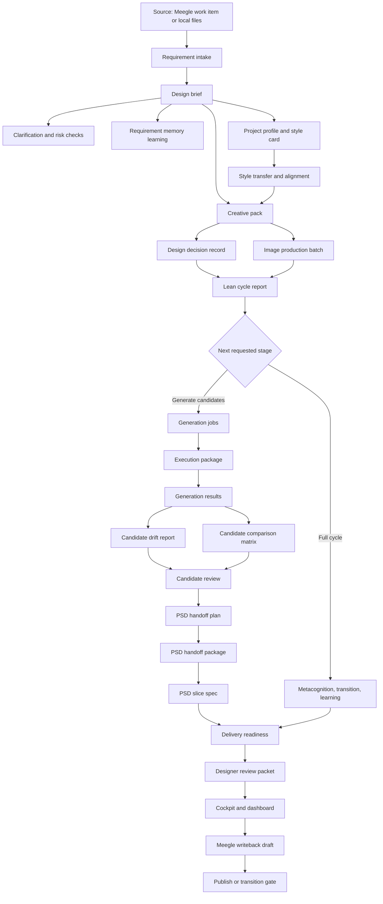

# Workflow Map

This document maps the current design-copilot workflow into capability phases. It is a blueprint view of existing behavior, not a code change plan.

The active workflow is lean by default. `run-feishu-design-cycle` and `run-local-design-cycle` prepare the current design context and stop before downstream governance artifacts. Add `--full` only when the user explicitly wants the complete audit, learning, readiness, workflow, and review loop.

## End-To-End Flow

## Default Cycle Commands

The cycle commands are the daily copilot entrypoints:

- `python -m agent.cli run-feishu-design-cycle --project-key <space> --work-item-id <id>`
- `python -m agent.cli run-local-design-cycle --project-key <key> --work-item-id <id> --title <title> --requirement-file <path>`

Default cycle output is intentionally small:

- requirement and clarification reports
- style card, style transfer, and style alignment reports
- creative pack and design decision record
- delivery manifest and image generation batch
- designer workpack artifacts such as the task sheet and prompt file
- cycle report with skipped-step notes and the next smallest safe actions

Default cycle output does not include:

- `latest_learning_digest.json`
- `delivery_readiness_report.json`
- `design_workflow_plan.json`
- `designer_review_packet.json`

Use the corresponding `--full` flag when those artifacts are truly needed. When a default cycle reuses an output directory that contains historical full-cycle directories, it removes `delivery_readiness`, `workflow`, and `review_packet` from that run directory so the folder reflects the current mode.

## Phase 1: Requirement Intake

Purpose: turn unstructured work item or local requirement evidence into a reliable `DesignBrief`.

Primary modules:

- `agent/core/requirement_interpreter.py`
- `agent/core/risk_detector.py`
- `agent/core/requirement_clarifier.py`
- `agent/core/requirement_change.py`
- `agent/core/field_calibration.py`
- `agent/core/workitem_intake.py`

Typical outputs:

- `design_brief.json`
- `design_brief.md`
- `requirement_clarification_report.json`
- `requirement_clarification_report.md`
- `requirement_clarification_comment.md`
- `requirement_change_report.json`
- `workitem_intake_diagnostics.json`
- `field_calibration_report.json`

## Phase 2: Style And Project Context

Purpose: decide which style knowledge is safe to use and which rules remain exploratory.

Primary modules:

- `agent/core/project_profiles.py`
- `agent/core/style_transfer.py`
- `agent/core/style_alignment.py`
- `agent/core/style_references.py`
- `agent/core/style_learner.py`

Typical outputs:

- `project_profile.json`
- `style_card.json`
- `style_transfer_report.json`
- `style_alignment_report.json`
- `latest_style_reference_report.json`
- `review_report.json`

Key rule: K1 and K2 may enter executable guidance. K3 remains exploratory unless promoted through governed learning.

## Phase 3: Creative Pack

Purpose: create the central execution package for the current task.

Primary module:

- `agent/core/creative_pack.py`

Supporting modules:

- `agent/core/decision_recorder.py`
- `agent/core/workflow_plan.py`
- `agent/core/cycle_report.py`

The `CreativePack` contains:

- `brief`: the task definition and constraints.
- `style_card`: the current style memory used for the task.
- `references`: source evidence and reference groups.
- `prompt_pack`: positive prompts, negative prompts, and reference groups.
- `composition_suggestions`: layout and visual hierarchy guidance.
- `psd_guidance`: layer, slicing, and editability guidance.
- `uncertainties`: unresolved questions and K3 boundaries.
- `delivery_manifest`: export items, naming rules, slice notes, and confirmation requirement.

Typical outputs:

- `creative_pack.json`
- `creative_pack.md`
- `design_decision_record.json`
- `design_decision_record.md`
- `design_cycle_report.json`

Mode note: `design_workflow_plan.json` is a full-cycle or explicit planning artifact. It is not produced by the default cycle commands.

## Phase 4: Image Production

Purpose: convert the creative pack into reviewable candidate directions without directly executing generation.

Primary modules:

- `agent/core/image_production.py`
- `agent/core/generation_queue.py`
- `agent/core/image_execution_package.py`

Typical outputs:

- `image_generation_batch.json`
- `image_generation_batch.md`
- `candidate_evaluation.md`
- `image_generation_jobs.json`
- `pixpark_requests.jsonl`
- `generation_approval_ticket.md`
- `image_execution_package.json`
- `pixpark_execution_runbook.md`
- `generation_results_template.json`

Safety rule: generation job creation does not call Pixpark or spend credits by itself.

## Phase 5: Candidate Review

Purpose: register generated assets, compare variants, and turn designer decisions into learning signals.

Primary modules:

- `agent/core/generation_results.py`
- `agent/core/candidate_style_drift.py`
- `agent/core/candidate_comparison.py`
- `agent/core/candidate_review.py`

Typical outputs:

- `image_generation_results.json`
- `generated_gallery.md`
- `delivery_candidates.md`
- `candidate_style_drift_report.json`
- `candidate_comparison_matrix.json`
- `*-candidate_review.json`
- `*-candidate_review.md`

## Phase 6: PSD And Slicing

Purpose: translate selected candidates into production-oriented PSD reconstruction and slicing guidance.

Primary modules:

- `agent/core/psd_handoff.py`
- `agent/core/psd_handoff_package.py`
- `agent/core/psd_slice_spec.py`
- `agent/core/automation_planner.py`

Typical outputs:

- `psd_handoff_plan.json`
- `psd_handoff_plan.md`
- `layer_map.md`
- `slice_checklist.md`
- `psd_handoff_package.json`
- `psd_handoff_approval_ticket.md`
- `psd_slice_spec_report.json`
- `automation_plan.json`
- `automation_stub.ps1`
- `photoshop_export_dry_run.jsx`

Safety rule: PSD and automation artifacts are review-first; they do not overwrite formal assets by default.

## Phase 7: Delivery And Review

Purpose: gather all evidence into a final local quality gate and designer decision surface.

Primary modules:

- `agent/core/delivery_readiness.py`
- `agent/core/review_packet.py`
- `agent/core/designer_cockpit.py`
- `agent/core/designer_dashboard.py`

Typical outputs:

- `delivery_readiness_report.json`
- `designer_review_packet.json`
- `designer_cockpit.json`
- `dashboard.html`
- `dashboard_data.json`

Mode note: delivery readiness and designer review packets are full-cycle or explicit stage artifacts. They are skipped by default cycle commands and should not appear as missing future-stage requirements in artifact indexes.

## Phase 8: Collaboration Writeback

Purpose: prepare reviewed Meegle comments and workflow transitions behind explicit gates.

Primary modules:

- `agent/core/meegle_writeback.py`
- `agent/core/meegle_publish.py`
- `agent/core/meegle_transition.py`

Typical outputs:

- `meegle_writeback_draft.json`
- `meegle_writeback_comment.md`
- `meegle_writeback_approval_ticket.md`
- `meegle_publish_receipt.json`
- `meegle_transition_draft.json`
- `meegle_transition_approval_ticket.md`
- `meegle_transition_receipt.json`

Safety rule: publish and transition operations require explicit confirmation.

## Phase 9: Session And Recovery

Purpose: make the next run resumable without re-reading an entire chat history.

Primary modules:

- `agent/core/session.py`
- `agent/core/session_resume.py`
- `agent/core/transition_summary.py`
- `agent/core/learning_digest.py`
- `agent/core/doctor.py`

Typical outputs:

- `session_resume.json`
- `latest_transition.json`
- `latest_learning_digest.json`
- `doctor_report.json`

Mode note: transition summaries and learning digests are part of the full-cycle governance path. They should not be created just because a designer needs the next lean production step.

## Artifact Index Rules

Workflow and review surfaces are stage-aware:

- List existing artifacts only.
- Use `暂无已生成产物。` when no relevant artifact exists.
- Do not list future-stage assets as `缺失`.
- Warn about missing artifacts only when they block the current stage.

This keeps cycle, workflow, and review outputs useful as operator surfaces instead of turning them into inventories of work the user did not ask to run.
